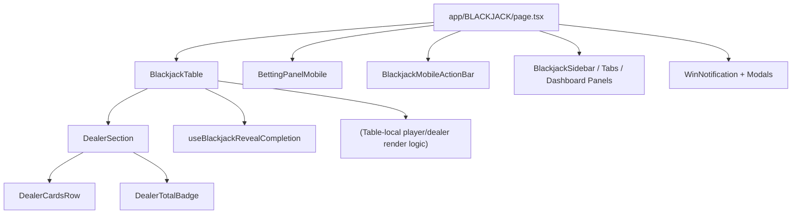
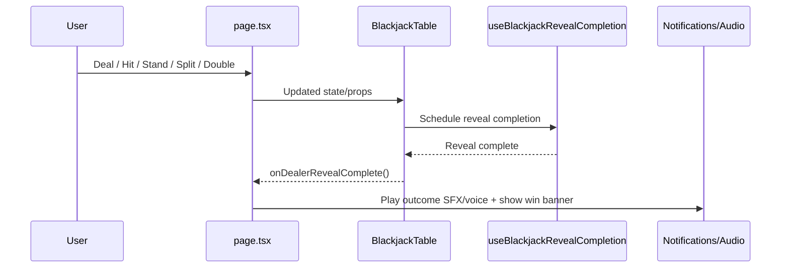

# Blackjack (Single-Player) — Reference

This page documents the current single-player Blackjack architecture and how it connects to shared UI pieces used by multiplayer.

Primary route:

- `app/BLACKJACK/page.tsx`

Core shared components/hooks:

- `components/BLACKJACK/BlackjackTable.tsx`
- `components/BLACKJACK/DealerSection.tsx`
- `components/BLACKJACK/DealerCardsRow.tsx`
- `components/BLACKJACK/DealerTotalBadge.tsx`
- `components/BLACKJACK/BettingPanelMobile.tsx`
- `components/BLACKJACK/BlackjackMobileActionBar.tsx`
- `hooks/use-blackjack-dealer-reveal.ts`
- `hooks/use-blackjack-reveal-completion.ts`

---

## High-Level Responsibilities

- `app/BLACKJACK/page.tsx`
  - Owns orchestration/state for game lifecycle, wallet interactions, and page-level layout.
  - Wires audio, notifications, sidebars, chart/dashboard panels, and modals.
  - Passes normalized props into `BlackjackTable`.
- `components/BLACKJACK/BlackjackTable.tsx`
  - Owns table-surface rendering, dealer/player card presentation, and in-hand interaction behavior.
  - Uses shared dealer primitives and reveal-completion hook for reveal timing.
- Shared dealer primitives
  - `DealerSection` composes dealer cards + total badge.
  - `DealerCardsRow` and `DealerTotalBadge` isolate visuals from page/game orchestration.

---

## Component Diagram

---

## Data/Control Flow

---

## Styling Notes

- Tailwind is the primary styling system.
- Inline styles are used where dynamic gradients/shadows or computed values are required.
- Keep class names aligned with shared blackjack visuals (`glass-counter`, card overlap classes, etc.) to maintain parity with multiplayer.

---

## Safe Refactor Rules

- Preserve reveal timing behavior when touching dealer flow.
- Keep `bigint` for value amounts; avoid JS `number` for wager/payout math.
- If payload shape changes across WS/API boundaries are needed, update both server + client contracts.
- Prefer extending shared primitives (`DealerSection`, hooks) before duplicating logic in `page.tsx`.

---

## Quick Validation Checklist

- Single hand: deal -> player actions -> dealer reveal -> outcome banner/audio.
- Blackjack path: natural blackjack presentation and payout text.
- Bust and push paths: correct badge/result rendering.
- Mobile layout: betting panel and action bar remain usable and non-overlapping.
