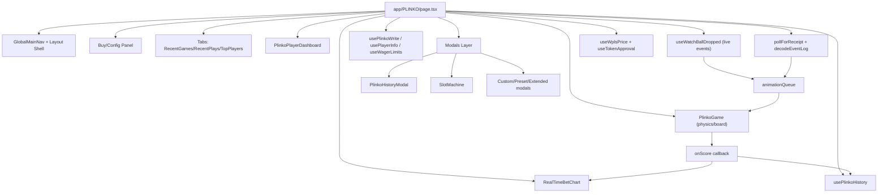

# PLINKO Engineering README

Living document for current frontend architecture, audit findings, and refactor plan.

## Purpose

- Track how `app/PLINKO/page.tsx` is wired today.
- Keep a complete component inventory for faster audits.
- Record performance/bug fixes and what should be split next.
- Provide a repeatable checklist before/after changes.

## Current Status

- Primary page orchestration lives in `app/PLINKO/page.tsx`.
- UI + blockchain state + animation queue + modal state are all centralized in the page.
- This file currently acts as both container and feature logic layer.

## Full Component Inventory

### App Layer (`app/PLINKO`)

- `page.tsx` - main orchestrator for state, wallet interactions, queue, and layout.
- `layout.tsx` - route-level layout wrapper.
- `types.ts` - local page/game type definitions.
- `constants.ts` - risk levels, names, multipliers, mappings.
- `plinko.css` - plinko-specific styling.

### PLINKO Components (`components/PLINKO`)

- `PlinkoGame.tsx` - board/physics renderer and scoring callbacks.
- `RealTimeBetChart.tsx` - P&L/session chart.
- `PlinkoPlayerDashboard.tsx` - user dashboard/stats card.
- `PlinkoRecentGames.tsx` - recent game feed.
- `PlinkoRecentPlays.tsx` - recent play feed.
- `PlinkoTopPlayers.tsx` - leaderboard panel.
- `SlotMachine.tsx` - transaction confirmation visual state.
- `Footer.tsx` - page footer.
- `PlinkoHistoryModal.tsx` - history modal.
- `PresetAmountsModal.tsx` - preset wager picker.
- `ExtendedHistoryModal.tsx` - expanded local history.
- `HowToPlayModal.tsx` - instructions/help modal.
- `ShareModal.tsx` - share flow modal.
- `ShareButton.tsx` - share action trigger.
- `ContactModal.tsx` - contact modal.
- `SwapModal.tsx` - token swap modal.
- `FAQModal.tsx` - FAQ modal.
- `PlinkoModalsHost.tsx` - centralized Plinko modal wiring.
- `PlinkoLiveOverlay.tsx` - live in-game overlay.

### Shared Components Used by PLINKO Page

- `components/shared/GlobalMainNav.tsx`
- `components/shared/GameFAQ.tsx`
- `components/shared/PlayerProfileModal.tsx`
- `components/shared/AdSpace.tsx`
- `components/shared/MorbiusLoadingChip.tsx`

### Hooks and Data Interfaces Used by PLINKO Page

- `hooks/use-plinko-contract.ts` (`usePlayerInfo`, `useWagerLimits`, `usePlinkoWrite`, `useWatchBallDropped`)
- `hooks/use-plinko-history.ts`
- `hooks/use-wpls-price.ts`
- `hooks/use-token-approval.ts`

## Architecture Diagram

## Recent Fixes (Apr 2026)

- Prevented duplicate self-event animation by skipping own `BallDropped` events from watcher path.
- Fixed contract drop history wager capture to use the wager from the purchase flow.
- Corrected transaction status check for viem receipt status shape.
- Added timeout cleanup and functional queue update in animation queue processing.
- Made auto-drop interval respond instantly to `dropSpeed` changes.
- Removed BigInt precision risk in PLS total display (`formatEther` path).
- Removed legacy autoplay feature from active Plinko runtime flow:
  - deleted autoplay state machine wiring from `app/PLINKO/page.tsx`,
  - removed `AutoPlaySettings` usage and auto-drop interval logic,
  - `PlinkoBoardShell` now receives `remainingBalls={0}` (no autoplay rounds tracking).
- Updated shared navigation behavior used by Plinko:
  - nav avatar in wallet is now static image/icon only (no animated avatar render in main nav),
  - desktop sidebar width/label transitions are disabled (instant open/close),
  - icon-anchor alignment is stabilized to prevent shift/jump during expand/collapse.

## Optimization and Decomposition Audit

### Why `page.tsx` should be split

- It currently mixes at least four concerns:
  - chain transaction orchestration,
  - animation/queue state machine,
  - heavy presentation/layout rendering,
  - modal lifecycle/visibility state.
- This increases re-render blast radius and makes changes riskier.

### Recommended Splits (Priority Order)

1. `PlinkoBuyPanel.tsx`
   - Extract buy controls, totals, risk/payment selection, speed buttons in panel.
   - Props: pure values + handlers only.
2. `PlinkoBoardShell.tsx`
   - Extract board wrapper, burst button, overlays, and `PlinkoGame` mount.
3. `PlinkoLiveOverlay.tsx`
   - Extract in-game overlay with chart + live history list.
4. `PlinkoModalsHost.tsx`
   - Centralize all modal rendering and open/close wiring.
5. `usePlinkoTransactionFlow.ts`
   - Move buy/drop/receipt decode/history-write flow out of component body.
6. `usePlinkoAnimationQueue.ts`
   - Own queue lifecycle, drop pacing, launch/scored counters, and guard timeouts.

### Expected Gains

- Smaller render surfaces and clearer memo boundaries.
- Fewer accidental stale closure bugs.
- Cleaner testability for transaction and queue logic.
- Easier future additions (provable fairness UI, extra risk modes, telemetry).

## Suggested Refactor Milestones

- Milestone 1 (safe): Extract `PlinkoModalsHost` and `PlinkoLiveOverlay`.
- Milestone 2 (medium): Extract `PlinkoBuyPanel` and `PlinkoBoardShell`.
- Milestone 3 (logic): Move queue + tx code into custom hooks.
- Milestone 4 (quality): Add unit tests for queue reducer-like transitions and receipt decoding edge cases.

## Working Checklist for Each Change

- [ ] Update this README with change summary + rationale.
- [ ] Validate no `BigInt -> Number` conversions on value paths.
- [ ] Verify watcher + receipt decoding do not double-apply results.
- [ ] Run lint on touched files.
- [ ] Smoke test free-play and contract flow.
- [ ] Confirm PulseScan links still use `https://scan.pulsechain.com`.

## Change Log

### 2026-04-02

- Initialized living engineering README with architecture inventory and split roadmap.
- Added decomposition plan for `page.tsx` refactor into smaller components/hooks.
- Completed Milestone 1 extraction:
  - added `components/PLINKO/PlinkoLiveOverlay.tsx` for in-game chart/history/speed overlay,
  - added `components/PLINKO/PlinkoModalsHost.tsx` for centralized modal rendering,
  - updated `app/PLINKO/page.tsx` to delegate overlay and modal sections.
- Completed Milestone 2 extraction:
  - added `components/PLINKO/PlinkoBuyPanel.tsx` for left-column buy/config/chart surface,
  - added `components/PLINKO/PlinkoBoardShell.tsx` for board panel + BURST control + game mount,
  - reduced `app/PLINKO/page.tsx` by delegating left and right gameplay columns to extracted components.
- Completed Milestone 3 extraction:
  - added `hooks/use-plinko-animation-queue.ts` to own queue pacing + in-flight counters + safety resets,
  - added `hooks/use-plinko-transaction-flow.ts` to own receipt polling and buy-and-drop transaction orchestration,
  - rewired `app/PLINKO/page.tsx` to consume both hooks and removed duplicated inline orchestration logic.
- Completed hardening pass after Milestone 3:
  - tightened transaction hook typing (`PublicClient`, `TransactionReceipt`, typed risk-map contract),
  - replaced remaining broad `any` error surface with `unknown` + normalized message handling,
  - removed stale/dead page code (unused event ABI/types/test-drop helper) and simplified queue hook API.
- Added test-friendly transaction utility extraction:
  - created `lib/plinko-transaction-utils.ts` with pure helpers:
    - `decodePlinkoBallDroppedLog(...)`
    - `getPlinkoTransactionErrorMessage(...)`
  - updated `hooks/use-plinko-transaction-flow.ts` to use shared helpers for cleaner logic and easier future unit tests.
- Follow-up cleanup and subscription stability pass:
  - removed dead page state and related effects (`isMobile`, `historyCardCount`, legacy `showBuyBallsModal`, stale `selectedRisk`),
  - stabilized watched contract event handling via memoized callback (`handleWatchBallDropped`) before passing into `useWatchBallDropped`,
  - eliminated stale/unused imports and obsolete helper wiring to reduce incidental re-renders and maintenance noise.
- Autoplay decommission + sidebar/nav stability pass:
  - removed leftover autoplay logic from `app/PLINKO/page.tsx` and aligned with current "manual drop/buy-and-drop only" flow,
  - removed main-nav avatar animation path for wallet display (static avatar only),
  - disabled sidebar width/text transitions and fixed icon anchor behavior to prevent visual shifting during nav expand/collapse.
