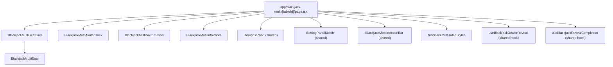
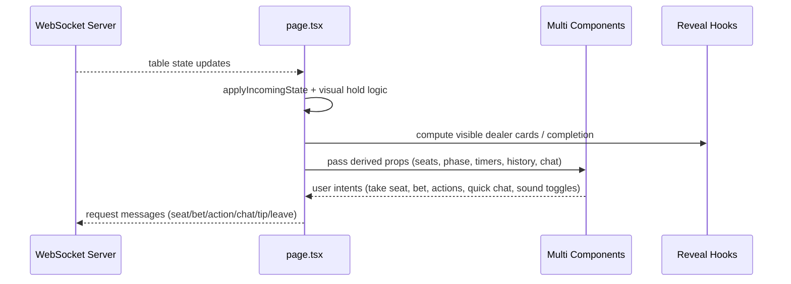

# Blackjack Multiplayer — Reference

This document describes the current multiplayer blackjack structure after UI refactors that split the table page into focused components.

Primary routes:

- `app/blackjack-multi/page.tsx` (lobby)
- `app/blackjack-multi/[tableId]/page.tsx` (table)

Main extracted multiplayer UI components:

- `components/BLACKJACK/multi/BlackjackMultiSeatGrid.tsx`
- `components/BLACKJACK/multi/BlackjackMultiSeat.tsx`
- `components/BLACKJACK/multi/BlackjackMultiAvatarDock.tsx`
- `components/BLACKJACK/multi/BlackjackMultiSoundPanel.tsx`
- `components/BLACKJACK/multi/BlackjackMultiInfoPanel.tsx`
- `components/BLACKJACK/multi/blackjackMultiTableStyles.ts`

Shared single/multi pieces:

- `components/BLACKJACK/DealerSection.tsx`
- `components/BLACKJACK/BettingPanelMobile.tsx`
- `components/BLACKJACK/BlackjackMobileActionBar.tsx`
- `hooks/use-blackjack-dealer-reveal.ts`
- `hooks/use-blackjack-reveal-completion.ts`

---

## High-Level Responsibilities

- `app/blackjack-multi/[tableId]/page.tsx`
  - Orchestrates WebSocket state, wallet actions, round transitions, and table-level side effects.
  - Composes extracted UI modules and passes domain props/callbacks.
  - Keeps authoritative multiplayer control flow (seat/bet/action requests, audio triggers, round history feed).
- `BlackjackMultiSeatGrid`
  - Renders the 3 seats at absolute pixel coordinates within the 800×450 canvas space.
  - Seat positions are defined by `SEAT_ANCHORS` constants at the top of the file — edit those to reposition seats.
  - No nudge math or scale clamping; positions scale automatically via the parent `transform: scale(boardScale)`.
- `BlackjackMultiAvatarDock`
  - Bottom-left avatar cluster with acting/betting timers and radial/quick-chat interaction.
- `BlackjackMultiInfoPanel`
  - Right-side tabbed panel: Chat, Chart, Rules, History.
- `BlackjackMultiSoundPanel`
  - Top-left sound/music controls; receives state + handlers from page.

---

## Component Diagram

---

## Runtime Flow (Table)

---

## Multiplayer Boundaries

- **WebSocket contract discipline**
  - Treat table/chat payload shapes as API contracts.
  - Keep client + server message expectations in sync.
- **Money handling**
  - Keep wager/payout values as `bigint` internally.
  - Serialize numeric values safely at boundaries.
- **Visual parity**
  - Dealer reveal/counter behavior should stay aligned with single-player shared hooks/components.

---

## Styling Notes

- Tailwind is primary.
- Extracted table animations/classes are centralized in:
  - `components/BLACKJACK/multi/blackjackMultiTableStyles.ts`
- Theme treatment follows current dark panel + cyan accent system already used in blackjack/plinko surfaces.

## Layout System

The table canvas is always rendered at **800×450px** and scaled to fit the container via `transform: scale(boardScale)` where `boardScale = tableWidth / 800`. All child elements use coordinates in this 800×450 space — they scale automatically.

- **Seat positioning**: edit `SEAT_ANCHORS` in `BlackjackMultiSeatGrid.tsx` (pixel coords in 800×450 space).
- **Mobile**: portrait orientation is blocked with a "rotate your device" overlay. Landscape is required on screens ≤768px wide.

---

## Quick Validation Checklist

- Seating: join/leave on each position; verify seats appear at correct positions on desktop and mobile landscape.
- Mobile portrait: rotate-device prompt appears; game content is hidden.
- Betting: bet input + confirm flow, timeout states, idle warnings.
- Dealer reveal: progressive dealer cards, completion timing, outcome labels/audio.
- Chat tab: send + receive + cooldown behavior.
- Chart tab: remains mounted and updates per round.
- Rules/History tabs: render and switch without layout regressions.
